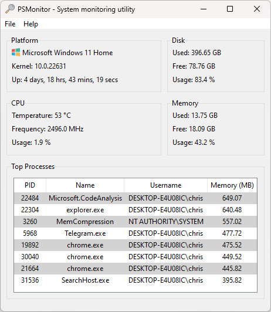
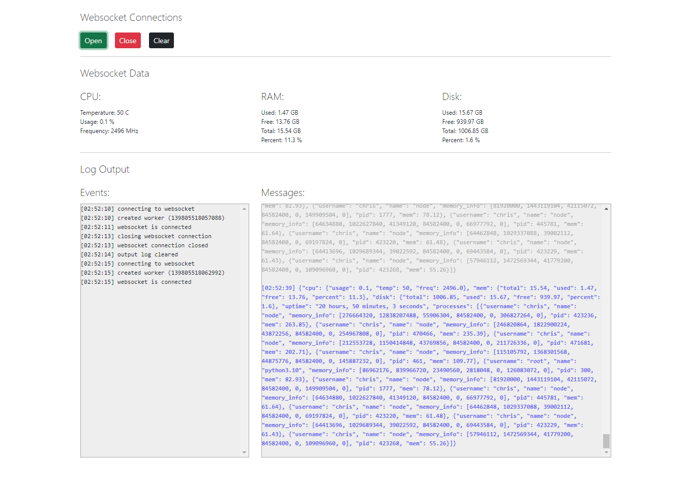

# psmonitor

A simple system and network monitoring solution with real-time data transmission via a websocket server.

This project includes [psutil](https://pypi.org/project/psutil/) scripts for gathering system and network statistics, and a [tornado](https://pypi.org/project/tornado/)-based websocket server for transmitting these statistics to connected clients.

Psmonitor also includes a desktop application.



View an example [web client dashboard here](https://github.com/sentrychris/system-monitor)

## Requirements

- Python 3

## Features

- **Asynchronous Data Collection**: Utilizes asyncio and ThreadPoolExecutor for efficient, non-blocking data collection.
- **Real-Time Monitoring**: Transmits live system and network statistics to clients via WebSocket.
- **System Statistics**: Provides CPU usage, memory usage, disk usage, system uptime, and top processes by memory usage.
- **Network Statistics**: Monitors data sent and received on a specified network interface.
- **Websocket Server**: Tornado-based server for real-time data transmission.

## Quick Start

1. Clone this repository:
    ```sh
    git clone git@github.com:sentrychris/psmonitor.git
    ```

2. Install dependencies:
    ```sh
    pip install -r requirements.txt
    ```

3. Run the server:
    ```sh
    python server.py run --port=<port> --address=<address>
    ```

The websocket server comes with a simple dashboard to test the websocket connection:




## Output

Here is the example output from the websocket connection:

```json
{
    "cpu": {
        "usage": 0,
        "temp": 50,
        "freq": 2496
    },
    "mem": {
        "total": 15.54,
        "used": 1.61,
        "free": 13.62,
        "percent": 12.2
    },
    "disk": {
        "total": 1006.85,
        "used": 15.67,
        "free": 939.97,
        "percent": 1.6
    },
    "uptime": "18 hours, 43 minutes, 4 seconds",
    "processes": [
        {
            "memory_info": [
                601661440,
                2731663360,
                47755264,
                84582400,
                0,
                611880960,
                0
            ],
            "name": "node",
            "username": "chris",
            "pid": 424191,
            "mem": 573.79
        },
        {
            "memory_info": [
                262885376,
                12823240704,
                55906304,
                84582400,
                0,
                292528128,
                0
            ],
            "name": "node",
            "username": "chris",
            "pid": 423236,
            "mem": 250.71
        },
        ...
    ]
}
```

## Desktop application

A desktop application is provided, everything is self-contained:

- The websocket server
- The system monitoring scripts
- The GUI

### Requirements

#### Linux
- python3-tk
- python3-pil.imagetk

To quickly run the desktop application:

```sh
python3 main.py
```

To build a single-file executable for Windows:
```sh
./scripts/build-exe
```

## Websocker server

### Running the server as a managed process

If you would like to run the server as a managed process, you can use the systemd service file provided.

1. Copy the service file and make any necessary changes:
    ```sh
    sudo cp ./psmonitor.service /etc/systemd/system/
    ```

2. Reload the daemon to recognize the new service:
    ```sh
    sudo systemctl daemon-reload
    ```

3. Start the service:
    ```sh
    sudo systemctl start psmonitor
    ```

Alternatively, you could use [supervisor](http://supervisord.org/) or something similar.


### Next steps

To connect to the WebSocket server, you can use any WebSocket client. Here is an example of how to connect using JavaScript:

1. Retrieve the assigned worker:

    ```js
    const client = await fetch(`http://<server-address>`, {
        method: 'POST',
        body: { connection: 'monitor' }
    });
    const worker = await client.json()
    ```

2. Open the WebSocket connection and retrieve data:
    ```js
    const url = `ws://<server-address>:<port>/ws?id=${worker.id}`;

    connection = new WebSocket(url);
    connection.onopen = () => {
        log.write('event', 'websocket is connected');
    }
    connection.onmessage = (response) => {
        const data = JSON.parse(response.data);
    }
    ```

You can also use WebSocket clients in other programming languages, such as Python, to connect to the server:

1. Retrieve an assigned worker:

    ```python
    import requests

    response = requests.post('http://<server-address>', json={'connection': 'monitor'})
    worker = response.json()
    ```

2. Open the WebSocket connection and retrieve data:
    ```python
    import asyncio
    import websockets

    async def connect():
        uri = f"ws://<server-address>:<port>/ws?id={worker['id']}"
        async with websockets.connect(uri) as websocket:
            async for message in websocket:
                print(message)

    asyncio.run(connect())
    ```

You can use the quick dashboard located at `public/index.html`  for further testing and exploration.

If you are using the [system monitor web client](https://github.com/sentrychris/system-monitor), there are instructions contained there to help you get setup and connected.

I hope you like it!

## License
This software is open-sourced software licensed under the MIT license.
